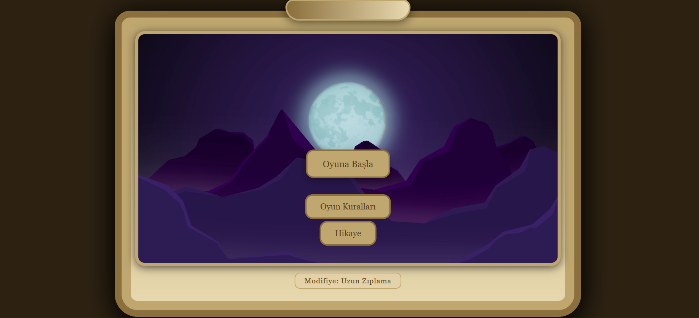
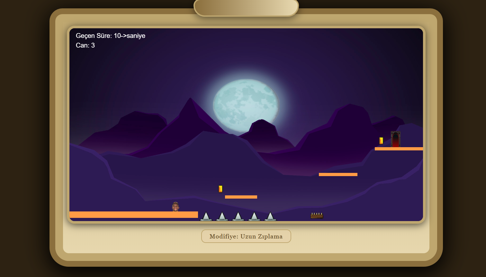

# 🎮 Mr Modifier
 HTML5 ve vanilla JavaScript ile geliştirililen paltformlar arasında ilerleyerek
farklı türdeki engelleri aşmaya çalıştığınız , özel güçler ve modifiye mekanikleriyle 
stratejik kararlar vermeniz gereken bir 2D platform oyunudur.

##  🕹️ Oyun Özellikleri

- Retro tarzda tasarım
- 3 farklı zorluk seviyesinde bölüm 
- 4 farklı özel güç sistemi
- Can sistemi
- Süre takibi
- Ses efektleri ve hareket animasyonu
  
## 🕹️ Kontroller

- A : Sola hareket
- D: Sağa hareket
- w: Zıplama
- L: Özel güç kullanımı
- Boşluk: Rastgele güç seçimi(3 kez kullanım sınırı)

## ⚙️ Oynanış Mekaniği
Özel Güçler
- Uzunz Zıplama: Daha yükseğe zıplama imkanı
- Aşağı Geçme: Platform içinden geçme
- Görünmezlik: Engellerde hasar almama belli bir süre için.

  Bu güçler boşluk tuşu ile rastege seçilir ve L tuşu ile aktifleştirilir.Her can da sadece 3 modifiye hakkınız vardır.

## 🛠️ Kullanılan Teknolojiler
- HTML5 Canvas
- JavaScript
- CSS

## 📁 Dosya Yapısı
Oyun/
├── index.html
├── img/
│   ├── bg.png
│   ├── karekter.png
│   ├── alev.webp
│   ├── dikenli.png
│   ├── portal.png
│   ├── coin.png
│   ├── diken1-5.png
│   └── l1-4.png
└── sounds/
    ├── bolum1.mp3
    ├── bolum2.mp3
    ├── damage.mp3
    ├── jump.wav
    └── coin.wav

